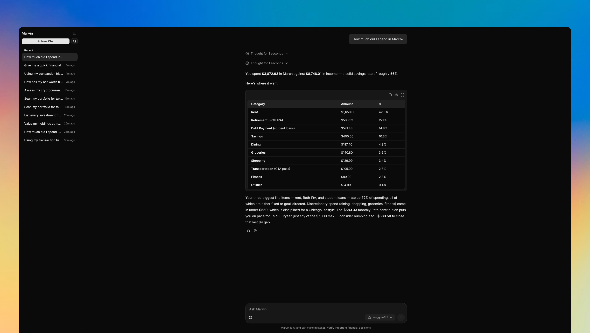

# Marvin



Marvin is a a local first, personal CFO assistant you chat with. It reads your accounts, balances, holdings, and transactions from CSV files, looks up live market prices, and answers questions about net worth, spending, runway, and more, using real data from tools, not guesses.

## Data stays local

Marvin runs on your machine. CSVs, SQLite, your profile, and chat history all live in `data/`. There's no hosted backend and no analytics.

Chat goes out to [OpenRouter](https://openrouter.ai/) (or whichever model provider you configure). Ticker prices come from Yahoo Finance. Your imports and database don't leave the machine.

## No Plaid

There's no bank aggregator integration. [Plaid](https://plaid.com/) is great when you need live syncing, but here it would mean per-connection fees, OAuth flows, and another copy of your transaction history on someone else's servers, which is a lot for a tool meant to run locally.

CSV exports from your bank or brokerage are enough. Drop them in `data/imports/` and re-export when you want fresh numbers. You control what gets imported, can edit the files by hand, and can see exactly what Marvin has. The catch is there's no automatic sync.

## How it works

Your financial data lives in `data/imports/` as CSVs. On startup, Marvin imports them into a local SQLite database. A short profile in `data/profile.txt` gives the agent context about your goals and situation. Chat runs through a Python API with a Next.js UI.

| File | Purpose |
|------|---------|
| `accounts.csv` | Account metadata (name, type, institution) |
| `balances.csv` | Cash balance snapshots by date |
| `holdings.csv` | Investment positions |
| `transactions.csv` | Income and spending (optional) |
| `profile.txt` | Personal context for the agent |

On first run, demo CSVs and a profile template are copied into `data/` automatically. Edit or replace them with your own data.

## Prerequisites

- [uv](https://docs.astral.sh/uv/) (Python 3.13+)
- Node.js 18+ (for the chat UI)
- An [OpenRouter](https://openrouter.ai/) API key

## Setup

```bash
# Install Python dependencies
uv sync

# Configure secrets and paths
cp .env.example .env
# Edit .env and set OPENROUTER_API_KEY at minimum

# Optional: customize your profile
cp data/profile.example.txt data/profile.txt
```

```bash
# Frontend (one-time)
cd frontend
cp .env.local.example .env.local
npm install
cd ..
```

## Run

From the repo root:

```bash
./start.sh
```

This starts the API on http://127.0.0.1:7932 and the chat UI on http://localhost:3000. The chat UI will automatically be opened in your default browser.

To run them separately:

```bash
# API only
uv run uvicorn app:app --host 127.0.0.1 --port 7932

# UI only (from frontend/)
npm run dev
```

CSV import runs automatically on API startup. To import manually:

```bash
uv run python -m scripts.import_data
```

## Development

```bash
uv sync --group dev
uv run ruff format .
uv run ruff check .
uv run ty check
uv run pytest --cov
```

See [`AGENTS.md`](AGENTS.md) for architecture, conventions, and contributor details.
